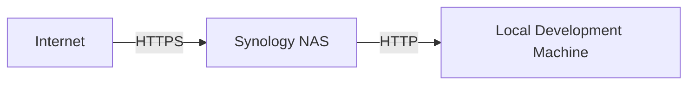

# Hosting and Debugging Local Applications with a Synology NAS Reverse Proxy

Have you ever found yourself tangled in the web of ngrok or other tunneling services to make your local development environment accessible for testing and debugging? As a developer working on Microsoft Teams apps, I faced a similar challenge. I wanted a more stable and cost-effective solution. That's where my Synology NAS (DS416slim running DSM 7.1.1-42962 Update 6) came into play, serving as a reliable self-hosted reverse proxy. Here's my journey and a step-by-step guide to help you do the same.

## Setting Up a Reverse Proxy on Synology NAS

A reverse proxy acts as a gateway between your local server and the internet, forwarding client requests to the server and returning the server's response to the client. This setup is especially useful when developing applications that require external access, like Microsoft Teams apps.

### The Initial Setup

I navigated through the DSM interface to Control Panel > Login Portal > Advanced > Reverse Proxy and configured the following:

### Example Configuration:

- Source (Internet Facing)
  - Protocol: `HTTPS`
  - Hostname: `*`
  - Port: `5201`
  - Enable HSTS: Checked
- Destination (Local Server)
  - Protocol: `HTTP`
  - Hostname: `192.168.1.60`
  - Port: `3007`

With this configuration, any HTTPS traffic coming to my NAS on port 5201 is terminated and forwarded to my local development machine on port 3007.

### Securing the Tunnel with Let's Encrypt

Security is paramount, especially when exposing local development servers to the internet. I decided to use Let's Encrypt to generate a free SSL certificate for my domain, automating the renewal process to keep the setup hassle-free.

### Domain and DNS Configuration with GoDaddy

Before obtaining the certificate, I needed a domain name with DNS records pointing to my NAS's public IP address. Here's the step-by-step process:

1. Find Your Public IP: I checked my current public IP address using whatismyip.com.
1. GoDaddy DNS Records: I logged into my GoDaddy account and navigated to My Products > DNS Management for my domain.
1. Edit A Records: I added/edited an A record with the following values:
  - Type: A
  - Host: @ (or a subdomain like nas)
  - Points to: [Your Public IP]
  - TTL: 1 hour (or the default value)

### Obtaining the Let's Encrypt Certificate

After setting up my DNS records, I proceeded to obtain a certificate from Let's Encrypt through my Synology NAS:

1. **Access Security Settings**: Control Panel > Security > Certificate.
1. **Add Certificate**: Add > Add a new certificate > Get a certificate from Let's Encrypt.
1. **Domain Details**: I entered my domain details and an email address for notifications.
1. **Automatic Renewal**: I made sure the auto-renewal feature was enabled.

### Integrating the Certificate with Reverse Proxy

Once I had my certificate, I assigned it to the reverse proxy service, ensuring all communications were encrypted.

## Wrapping Up

With these steps, I transformed my NAS into a secure gateway for my local development environment. This setup not only saved me from third-party service fees but also provided a stable and secure testing ground for my applications.

I hope this guide empowers you to explore beyond hosting and debugging Teams apps. With your NAS and a bit of curiosity, you could be on your way to hosting websites, setting up personal cloud services, or even running a mail server.

Feel free to share your experiences or any additional setups you've enabled with a NAS in the comments below!