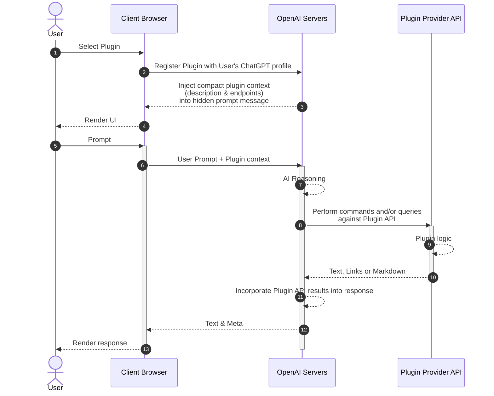
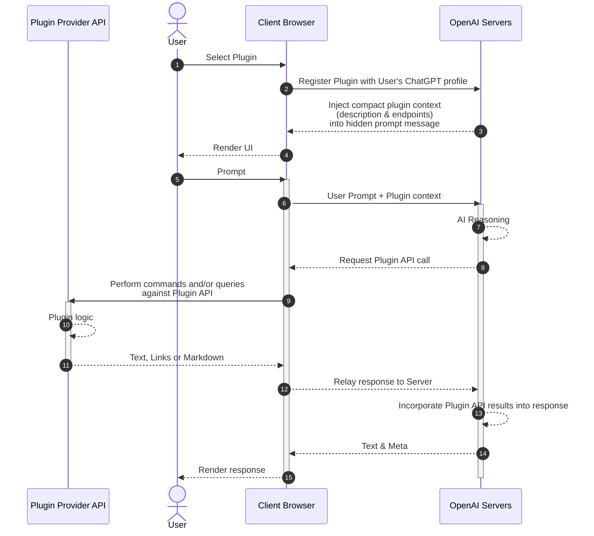

<div style="display: flex; flex-direction: column; align-items: center; justify-content: center">
  <iframe src="https://giphy.com/embed/NoHe3HpB1Mg8w" width="336" height="193" frameBorder="0" class="giphy-embed" allowFullScreen></iframe><p><a href="https://giphy.com/gifs/movie-up-NoHe3HpB1Mg8w">via GIPHY</a></p>
</div>

## Shiny New Toy

**Enter Stage Right:** ChatGPT's initial plugin framework release promises to dazzle by connecting it to the internet.  

> OpenAI plugins connect ChatGPT to third-party applications. These plugins enable ChatGPT to interact with APIs defined by developers, enhancing ChatGPT's capabilities and allowing it to perform a wide range of actions.
>
> *OpenAI*, [Chat Plugins](https://platform.openai.com/docs/plugins/introduction) [30 April 2023]

## Availability

At the moment, plugin development is a [*Limited Alpha* behind a wait-list](https://openai.com/waitlist/plugins) and plugins can be shared with up to [15 fellow developers](https://platform.openai.com/docs/plugins/introduction/plugin-flow) (who also have access to plugins).  It's early times for sure, but if the pace of ChatGPT over the past year is any indication we are sure to have a full marketplace of both free and paid plugins within weeks of my writing this blog post.

## Architecture

ChatGPT plugins are constructed with:
1. **One or more REST API endpoints** implemented in any language and/or framework you prefer: Node.js, Deno, .NET Web API or Minimal API, Ruby, Rust, Go, Azure APIM, Azure Logic App, Azure Function, AWS Lamda or whatever else you fancy. ([COBOL](https://www.ibm.com/docs/en/SS4SVW_3.0.0/backmatter/pdf.pdf) diehards rejoice!)
   - OpenAI provides a [Python-based "TODO API" plugin](https://github.com/openai/plugins-quickstart) to get you started with local experimentation.  It seems pretty useless until you realize that by tinkering with the inputs and outputs, even parameter names, you will begin to witness the power of ChatGPT's language processing capabilities; everything is context.
2. **A manifest file** (`yourdomain.com/.well-known/ai-plugin.json`) describing the plugin to ChatGPT.  The contents and structure of this file are likely to change, but the most critical bits are:
   - Plugin name and description (for display in the ChatGPT UI)
   - Plugin description (for the model to understand at a high level what your plugin does)
   - A logo URL
   - Your contact and legal information
   - Authentication mechanism, if applicable to your API
3. **An [OpenAPI specification](https://swagger.io/docs/specification/basic-structure/) (YAML) file**.  ChatGPT's language processing is a "natural" 🤣 at parsing this contract to understand what each API endpoint can do (descriptions, route methods) as well as how the input & output models are shaped (component schemas).  O**p**enAPI isn't to be confused with Open**AI**; this specification predates OpenAI and is used for all sorts of things unrelated to AI.  It's a well-established standard that is used by many API providers, including Microsoft, Google, and Amazon.  This alone is the most exciting/terrifying part - public REST APIs around the globe are already in a position to offer knowledge and actions to ChatGPT, merely by having an OpenAPI specification available.  What's more, the same specification supports describing that most common authentication patterns, so you can offer ChatGPT users the ability to authenticate with your API and perform actions on their behalf.

## Plugin Flow (Production)



## Plugin Flow (Local Development)

To enable local development of a plugin, ChatGPT turns the tables and calls your API from the browser.  This changes the flow dramatically:



## Local "Quickstart" Demo

OpenAI provides a sample TODO API on GitHub so that you can clone or download, and try it out with ChatGPT in a few minutes time.  It's implemented in Python, so if you don't already have a local Python development environment setup you'll need to do that.  

There are numerous ways of getting Python running locally.  For beginners, the article below walks you through setting up Python 3 on your operating system of choice:

[Python 3 Installation & Setup Guide](https://realpython.com/installing-python/)

### Running the Plugin (API) Locally

Once you have Python set up, execute the TODO API with `python main.py` and you'll see the server spin up and await calls from ChatGPT.  The output should look something like this:

```bash
> python main.py

 * Serving Quart app 'main'
 * Environment: production
 * Please use an ASGI server (e.g. Hypercorn) directly in production
 * Debug mode: True
 * Running on http://0.0.0.0:5003 (CTRL + C to quit)
[2023-04-30 17:56:58 -0400] [4776] [INFO] Running on http://0.0.0.0:5003 (CTRL + C to quit)
```

### Connect ChatGPT

Getting ChatGPT connected to the local TODO API is pretty straightforward. In a nutshell:
1. From any ChatGPT chat, change your Model to **Plugins** and then use the dropdown to navigate to the **Plugin Store**
2. Click **Develop your own plugin**
3. Supply the URL with port number (such as `http://localhost:5003`)

Once connected properly, you'll see the logo of your plugin displayed in the "Plugins" dropdown.

### Test Drive!

By installing your plugin in the previous step, you're providing ChatGPT with the manifest and OpenAPI specification, both of which inform the model of what your plugin API can do and how to interact.  

Let's get the show on the road.  I'd like to know what's on my TODO list (it should be empty at the moment), and I'll add some items afterward:


Okay that's neat.  What happens if I try to add more than one item at a time?


I'm mildly impressed that this prompt did all these things, but I'm less impressed that it required 7 API calls to add 7 items.  Why on earth didn't ChatGPT just send them all in one request?  Because our API doesn't support that in the request model, and ChatGPT is being a good consumer of the API.

We can refactor the Python code pretty quickly to support this.  We'll also need to change the request model to accept a list of items, and then we'll need to change the code to iterate over the list and add each item individually.  We'll also need to change the response model to return a list of items.  Let's do it...

```python
# main.py

# ...
@app.post("/todos/<string:username>")
async def add_todo(username):
    request = await quart.request.get_json(force=True)
    if username not in _TODOS:
        _TODOS[username] = []

    _TODOS[username].append(request["todo"])
    return quart.Response(response='OK', status=200)

# ... becomes:
@app.post("/todos/<string:username>")
async def add_todos(username):
    request = await quart.request.get_json(force=True)
    if username not in _TODOS:
        _TODOS[username] = []
    
    if 'todos' in request and isinstance(request['todos'], list):
      todos = request['todos']; # extract the list of todos
      for todo in todos:
        if todo not in _TODOS[username]: # don't add duplicates
          _TODOS[username].append(todo)
      return quart.Response(response='OK', status=200)
    else
      return quart.Response(response='Bad Request, todos missing', status=400)
```
```yaml
# openapi.yaml

# ...
components:
  schemas:
    getTodosResponse:
      # ...
    addTodoRequest:
      type: object
      required:
      - todo
      properties:
        todo:
          type: string
          description: The todo to add to the list.
          required: true

# ... becomes:

    addTodoRequest:
      type: object
      required:
      - todos
      properties:
        todos:
          type: array
          items:
            type: string
          description: The todos to add to the list.
          required: true
```

Let's summarize the changes we made:
- We changed the code to iterate over the list of todos
- We tweaked the code to disallow duplicate todos in the datastore (unplanned changed, but a good one).  Also unplanned, we added a check to make sure the request contained a list of todos.
- We changed the request model to accept a list of todos
- We updated the specification's request model definition *and description*

And now we can test it out:


Only one request.  Nice!  Let's flex our new-found muscles and add support for deleting multiple todos.  Our changes will be very similar:

```python
# main.py

# ...
@app.post("/todos/<string:username>")
async def add_todo(username):
    request = await quart.request.get_json(force=True)
    if username not in _TODOS:
        _TODOS[username] = []
    _TODOS[username].append(request["todo"])
    return quart.Response(response='OK', status=200)

# ... becomes:

@app.delete("/todos/<string:username>")
async def delete_todos(username):
    request = await quart.request.get_json(force=True)
    # fail silently, it's a simple plugin
    if 'todos_idx' in request and isinstance(request['todos_idx'], list):
        todos_idx = request["todos_idx"]
        for todo_idx in sorted(todos_idx, reverse=True):    
            if 0 <= todo_idx < len(_TODOS[username]):
                _TODOS[username].pop(todo_idx)
        return quart.Response(response='OK', status=200)
    else:
        return quart.Response(response='Bad Request, todos_idx missing', status=400)
```
```yaml
# openapi.yaml
    delete:
      operationId: deleteTodo
      summary: Delete a todo from the list
      # ...
      requestBody:
        required: true
        content:
          application/json:
            schema:
              $ref: '#/components/schemas/deleteTodoRequest'
      # ...
# ...
    delete:
      operationId: deleteTodos
      summary: Delete todos from the list
      # ...
      requestBody:
        required: true
        content:
          application/json:
            schema:
              $ref: '#/components/schemas/deleteTodosRequest'
# ...
components:
  schemas:
    # ...
    deleteTodoRequest:
      type: object
      required:
      - todo_idx
      properties:
        todo_idx:
          type: integer
          description: The index of the todo to delete.
          required: true
# ... becomes:
    deleteTodosRequest:
      type: object
      required:
      - todos_idx
      properties:
        todos_idx:
          type: array
          items:
            type: integer
          description: The indexes of the todos to delete.
          required: true
```

Let's summarize the changes we made:
- We changed the code to iterate over the list of todo indexes
- We changed the request model to accept a list of todo indexes
- We updated the specification's response model definition *and description*

Let's clear out our TODO list all at once:


I'm pretty forgetful.  For instance, I've been known to duplicate duplicate items to my grocery shopping list.  What would be the outcome with this ChatGPT TODO plugin?


Ugh oh.  Our plugin code disregards the duplicate entry, but as far as ChatGPT is concerned all is well up until the point that it loads again from the plugin and compares to its own internal list. 

The solution is for the plugin to respond to duplicate entry attempts with an informative message for ChatGPT to take into its context:


ChatGPT understands that `dentist` can't be added twice, but I'm not happy with it's mischaracterization "...was already on your list, so I didn't add it again."  Lies!  ChatGPT did indeed try to add `dentist` a second time, and was merely prohibited.  

I can resolve this by informing ChatGPT duplicates should not be added.  This might however result in ChatGPT querying all TODOs before each addition, causing a lot of unnecessary chatter.  Instead I'll tweak the plugin again, this time instruct ChatGPT to update its internal list when conflicts such as this occur:


## Conclusion

This is fun tech, for sure.  What will I do with it?  Hard to say - I'm just trying to keep up like everyone else.  I'm not sure if I'll be able to make a living off of it, but I'm sure I'll have fun trying.  I hope you do too!

<div class="references">

## References

1. [**OpenAI Platform** docs site](https://platform.openai.com/docs/introduction/overview) is a must-read on all matters of interacting with OpenAI's API.
   - [**Several more plugin examples**](https://platform.openai.com/docs/plugins/examples) with source code.  Check here for use of OAuth and other authentication methods, and giving ChatGPT more memory of conversations as well as semantic search (aka "question answering").
   - **Usage Policies** includes a [section on plugins](https://openai.com/policies/usage-policies#plugin-policies).  It's not mentioned in the enclosed changelog, so either it's been there all along or it's a new addition without notice.
2. [OpenAI Community Forum: "Context length VS Max token VS Maximum length"](https://community.openai.com/t/context-length-vs-max-token-vs-maximum-length/125585)

</div>
