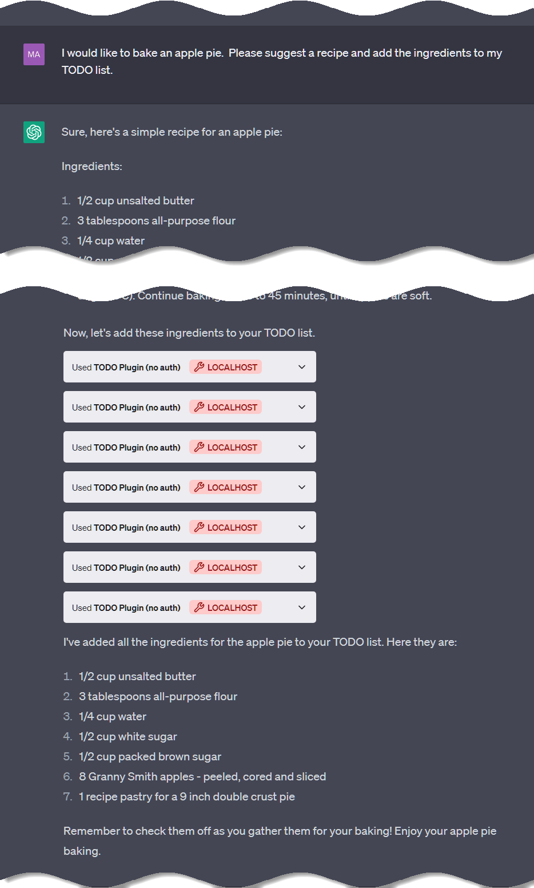

<div style="display: flex; flex-direction: column; align-items: center; justify-content: center">
  <iframe src="https://giphy.com/embed/NoHe3HpB1Mg8w" width="336" height="193" frameBorder="0" class="giphy-embed" allowFullScreen></iframe><p><a href="https://giphy.com/gifs/movie-up-NoHe3HpB1Mg8w">via GIPHY</a></p>
</div>

## Shiny New Toy

**Enter Stage Right:** ChatGPT's initial plugin framework release promises to dazzle by connecting it to the internet via REST APIs.  This is a big deal, and I'm excited to see where it goes.  I've been tinkering with the plugin framework for a few days now, and I'm impressed with the simplicity of the implementation and the power of the results.  I'm also impressed with the speed at which OpenAI is iterating on the framework, and I'm excited to see what the future holds.  I'm not sure if I'm more excited about the possibilities for ChatGPT or the possibilities for the plugin framework itself.  I'm sure both will be amazing.  

> OpenAI plugins connect ChatGPT to third-party applications. These plugins enable ChatGPT to interact with APIs defined by developers, enhancing ChatGPT's capabilities and allowing it to perform a wide range of actions.
>
> *OpenAI*, [Chat Plugins](https://platform.openai.com/docs/plugins/introduction) [30 April 2023]

## Availability

At the moment, plugin development is a [*Limited Alpha* behind a wait-list](https://openai.com/waitlist/plugins) and plugins can be shared with up to [15 fellow developers](https://platform.openai.com/docs/plugins/introduction/plugin-flow) (who also have access to plugins).  It's early times for sure, but if the pace of ChatGPT over the past year is any indication we are sure to have a full marketplace of both free and paid plugins within weeks of my writing this blog post.

## Architecture

ChatGPT plugins are constructed with:
1. **One or more REST API endpoints** implemented in any language and/or framework you prefer: Node.js, Deno, ASP .NET Controllers or Minimal API, Azure Functions, Ruby on Rails, Rust, Go, [Bip Functions](https://docs.bip.sh/functions/get-started), AWS Lamdas, [Wolfram](https://reference.wolfram.com/language/workflow/DeployAWebAPI.html) or whatever else you fancy ([COBOL](https://www.ibm.com/docs/en/SS4SVW_3.0.0/backmatter/pdf.pdf) diehards rejoice!).  Coded APIs aren't the only option either; you can just a easily use a [low-code/no-code](https://www.gartner.com/en/information-technology/glossary/low-code-no-code-development-platform-lcncdp) platform like [Power Apps](https://powerapps.microsoft.com/en-us/), [Power Automate](https://flow.microsoft.com/en-us/), Azure APIM, Azure Logic App, [Data API Builder](https://learn.microsoft.com/en-us/azure/data-api-builder/overview-to-data-api-builder), or [OutSystems](https://www.outsystems.com/blog/posts/low-code-api/).  The only requirement is that your API is accessible via the internet.
   - OpenAI provides a [Python-based "TODO API" plugin](https://github.com/openai/plugins-quickstart) to get you started with local experimentation.  It seems pretty useless until you realize that by tinkering with the inputs and outputs, descriptions, even parameter names, you will begin to witness the power of ChatGPT's language processing capabilities.
2. **A manifest file** (`yourdomain.com/.well-known/ai-plugin.json`) describing the plugin to ChatGPT.  The contents and structure of this file are likely to change, but the most critical bits are:
   - Plugin name and description (for display in the ChatGPT UI)
   - Plugin description (for the model to understand at a high level what your plugin does)
   - A logo URL
   - Your contact and legal information
   - Authentication mechanism, if applicable to your API
3. **An [OpenAPI specification](https://swagger.io/docs/specification/basic-structure/) (YAML) file**.  ChatGPT's language processing is a "natural" 🤣 at parsing this contract to understand what each API endpoint can do (descriptions, route methods) as well as how the input & output models are shaped (component schemas).  O**p**enAPI isn't to be confused with Open**AI**; this specification predates OpenAI and is used for all sorts of things unrelated to AI.  It's a well-established standard that is used by many API providers, including Microsoft, Google, and Amazon.  This alone is the most exciting/terrifying part - public REST APIs around the globe are already in a position to offer knowledge and actions to ChatGPT, merely by having an OpenAPI specification available.  What's more, the same specification supports describing that most common authentication patterns, so you can offer ChatGPT users the ability to authenticate with your API and perform actions on their behalf.

## Plugin Flow (Production)


## Plugin Flow (Local Development)

To enable local development of a plugin, ChatGPT turns the tables and calls your API from the browser.  This changes the flow dramatically:


## Local "Quickstart" Demo

OpenAI provides a sample TODO API on GitHub so that you can clone or download, and try it out with ChatGPT in a few minutes time.  It's implemented in Python, so if you don't already have a local Python development environment setup you'll need to do that.  

There are numerous ways of getting Python running locally.  For beginners, the article below walks you through setting up Python 3 on your operating system of choice:

[Python 3 Installation & Setup Guide](https://realpython.com/installing-python/)

### Running the Plugin (API) Locally

Once you have Python set up, execute the TODO API with `python main.py` and you'll see the server spin up and await calls from ChatGPT.  The output should look something like this:

```bash
> python main.py

 * Serving Quart app 'main'
 * Environment: production
 * Please use an ASGI server (e.g. Hypercorn) directly in production
 * Debug mode: True
 * Running on http://0.0.0.0:5003 (CTRL + C to quit)
[2023-04-30 17:56:58 -0400] [4776] [INFO] Running on http://0.0.0.0:5003 (CTRL + C to quit)
```

### Connect ChatGPT

Getting ChatGPT connected to the local TODO API is pretty straightforward. In a nutshell:
1. From any ChatGPT chat, change your Model to **Plugins** and then use the dropdown to navigate to the **Plugin Store**
2. Click **Develop your own plugin**
3. Supply the URL with port number (such as `http://localhost:5003`)

Once connected properly, you'll see the logo of your plugin displayed in the "Plugins" dropdown.

### Test Drive!

By installing your plugin in the previous step, you're providing ChatGPT with the manifest and OpenAPI specification, both of which inform the model of what your plugin API can do and how to interact.  

Let's get the show on the road.  I'd like to know what's on my TODO list (it should be empty at the moment), and I'll add some items afterward:


Okay that's neat.  What happens if I try to add more than one item at a time?



I'm mildly impressed that this prompt did all these things, but I'm less impressed that it required 7 API calls to add 7 items.  Why on earth didn't ChatGPT just send them all in one request?  Because our API doesn't support that in the request model, and ChatGPT is being a good consumer of the API.

We can refactor the Python code pretty quickly to support this.  We'll also need to change the request model to accept a list of items, and then we'll need to change the code to iterate over the list and add each item individually.  We'll also need to change the response model to return a list of items.  Let's do it...

```python
# main.py

# ...
@app.post("/todos/<string:username>")
async def add_todo(username):
    request = await quart.request.get_json(force=True)
    if username not in _TODOS:
        _TODOS[username] = []

    _TODOS[username].append(request["todo"])
    return quart.Response(response='OK', status=200)

# ... becomes:
@app.post("/todos/<string:username>")
async def add_todos(username):
    request = await quart.request.get_json(force=True)
    if username not in _TODOS:
        _TODOS[username] = []
    
    if 'todos' in request and isinstance(request['todos'], list):
      todos = request['todos']; # extract the list of todos
      for todo in todos:
        if todo not in _TODOS[username]: # don't add duplicates
          _TODOS[username].append(todo)
      return quart.Response(response='OK', status=200)
    else
      return quart.Response(response='Bad Request, todos missing', status=400)
```
```yaml
# openapi.yaml

# ...
components:
  schemas:
    getTodosResponse:
      # ...
    addTodoRequest:
      type: object
      required:
      - todo
      properties:
        todo:
          type: string
          description: The todo to add to the list.
          required: true

# ... becomes:

    addTodoRequest:
      type: object
      required:
      - todos
      properties:
        todos:
          type: array
          items:
            type: string
          description: The todos to add to the list.
          required: true
```

Let's summarize the changes we made:
- We changed the code to iterate over the list of todos
- We tweaked the code to disallow duplicate todos in the datastore (unplanned changed, but a good one).  Also unplanned, we added a check to make sure the request contained a list of todos.
- We changed the request model to accept a list of todos
- We updated the specification's request model definition *and description*

And now we can test it out:


Only one request.  Nice!  Let's flex our new-found muscles and add support for deleting multiple todos.  Our changes will be very similar:

```python
# main.py

# ...
@app.delete("/todos/<string:username>")
async def delete_todo(username):
    request = await quart.request.get_json(force=True)
    todo_idx = request["todo_idx"]
    # fail silently, it's a simple plugin
    if 0 <= todo_idx < len(_TODOS[username]):
        _TODOS[username].pop(todo_idx)
    return quart.Response(response='OK', status=200)

# ... becomes:

@app.delete("/todos/<string:username>")
async def delete_todos(username):
    request = await quart.request.get_json(force=True)
    if 'todos_idx' in request and isinstance(request['todos_idx'], list):
        todos_idx = request["todos_idx"]
        for todo_idx in sorted(todos_idx, reverse=True):    
            if 0 <= todo_idx < len(_TODOS[username]):
                _TODOS[username].pop(todo_idx)
        return quart.Response(response='OK', status=200)
    else:
        return quart.Response(response='Bad Request, todos_idx missing', status=400)
```
```yaml
# openapi.yaml
    delete:
      operationId: deleteTodo
      summary: Delete a todo from the list
      # ...
      requestBody:
        required: true
        content:
          application/json:
            schema:
              $ref: '#/components/schemas/deleteTodoRequest'
      # ...
# ...
    delete:
      operationId: deleteTodos
      summary: Delete todos from the list
      # ...
      requestBody:
        required: true
        content:
          application/json:
            schema:
              $ref: '#/components/schemas/deleteTodosRequest'
# ...
components:
  schemas:
    # ...
    deleteTodoRequest:
      type: object
      required:
      - todo_idx
      properties:
        todo_idx:
          type: integer
          description: The index of the todo to delete.
          required: true
# ... becomes:
    deleteTodosRequest:
      type: object
      required:
      - todos_idx
      properties:
        todos_idx:
          type: array
          items:
            type: integer
          description: The indexes of the todos to delete.
          required: true
```

Let's summarize the changes we made:
- We changed the code to iterate over the list of todo indexes
- We changed the request model to accept a list of todo indexes
- We updated the specification's response model definition *and description*

Let's clear out our TODO list all at once:


I'm pretty forgetful.  For instance, I've been known to duplicate items on the grocery shopping list.  What would be the outcome with this ChatGPT TODO plugin as it's currently implemented?


Ugh oh.  Our plugin code disregards the duplicate entry, but as far as ChatGPT is concerned all is well up until the point that it loads again from the plugin and compares to its own internal list. We need to provide some clarity to the AI.

The solution is for the plugin to respond to duplicate entry attempts with an informative message for ChatGPT to take into its context:


ChatGPT understands that `dentist` can't be added twice, but I'm not happy with its mischaracterization "...was already on your list, so I didn't add it again."  Lies!  ChatGPT did indeed try to add `dentist` a second time and was merely prohibited.  

I can resolve this by informing ChatGPT duplicates should not be added.  This might however result in ChatGPT querying all TODOs before each addition, causing a lot of unnecessary chatter.  Instead, I'll tweak the plugin again, this time instructing ChatGPT to update its internal list when conflicts such as this occur:


## The Plugin Store

ChatGPT's Plugin Store already has a wide variety of offerings.  In the few days it's taken me to write this blob post, I've seen a lot of new plugins pop up.  At the time of this writing, there are <span for="chat-gpt-plugins-list-count">0</span> plugins available to me as a registered developer:

<pre name="chat-gpt-plugins-list" class="json-object-array-to-table" style="display: none;" data-sort-by-property="name">
[
  {
    "name": "Wolfram",
    "description": "Access computation, math, curated knowledge & real-time data through Wolfram|Alpha and Wolfram Language."
  },
  {
    "name": "Lexi Shopper",
    "description": "Get product recommendations from your local Amazon store."
  },
  {
    "name": "MixerBox News",
    "description": "Get latest news delivered right to you! Stay informed with bulletins across multiple categories from credible sources."
  },
  {
    "name": "QuickRecall",
    "description": "Create flashcards and review them with spaced repeition."
  },
  {
    "name": "ChatSpot",
    "description": "Get access to marketing/sales data including domain information, company research and search keyword research."
  },
  {
    "name": "Tutory",
    "description": "Access affordable, on-demand tutoring and education right at your fingertips."
  },
  {
    "name": "Bohita",
    "description": "Create apparel with any image you can describe! Get it delivered right to your door."
  },
  {
    "name": "Abridged Due Diligence",
    "description": "Discover the details! Search through recent SEC filings, with links to deeper analysis."
  },
  {
    "name": "Video Insights",
    "description": "Interact with online video platforms like Youtube or Daily Motion."
  },
  {
    "name": "Expedia",
    "description": "Bring your trip plans to life – get there, stay there, find things to see and do."
  },
  {
    "name": "Glowing",
    "description": "Schedule and send daily SMS messages - reminders, inspiration, helpers and more."
  },
  {
    "name": "Ai Tool Hunt",
    "description": "Explore the ideal AI solutions for all use cases, drawn from the most comprehensive global database of AI tools."
  },
  {
    "name": "Zapier",
    "description": "Interact with over 5,000+ apps like Google Sheets, Gmail, HubSpot, Salesforce, and thousands more."
  },
  {
    "name": "Speak",
    "description": "Learn how to say anything in another language with Speak, your AI-powered language tutor."
  },
  {
    "name": "Tasty Recipes",
    "description": "Discover recipe ideas, meal plans and cooking tips from Tasty's millions of users!"
  },
  {
    "name": "World News",
    "description": "Summarize news headlines. You can ask for the latest news from various sources around the world."
  },
  {
    "name": "Competitor PPC Ads",
    "description": "Discover your competitors' best PPC ads by entering their website address."
  },
  {
    "name": "Keyplays Live Soccer",
    "description": "Latest live soccer standings, results, commentary, tv stations, keyplays (with and without scores)."
  },
  {
    "name": "Turo",
    "description": "Search for the perfect Turo vehicle for your next trip."
  },
  {
    "name": "PlaylistAI",
    "description": "Create Spotify playlists for any prompt."
  },
  {
    "name": "Boolio",
    "description": "The easiest way to analyze global stock values with the power of quantitative factor methodologies."
  },
  {
    "name": "Hauling Buddies",
    "description": "Locate dependable animal transporters using recommendations, reviews, and regulatory compliance search features."
  },
  {
    "name": "Vivian Health",
    "description": "Take the first step to finding your next healthcare job."
  },
  {
    "name": "DAIZY",
    "description": "Deep insights on ETFs, stocks, cryptos. Institutional-grade data: performance, risk, sustainability, research."
  },
  {
    "name": "Prompt Perfect",
    "description": "Type 'perfect' to craft the perfect prompt, every time."
  },
  {
    "name": "Weather Report",
    "description": "Current weather data for cities and airports using METAR aviation feeds."
  },
  {
    "name": "ChatWithVideo",
    "description": "Ask questions, analyzing, and parsing through YouTube videos by simply providing a YouTube video URL."
  },
  {
    "name": "Options Pro",
    "description": "Options Pro is your personal options trading assistant to help you navigate market conditions."
  },
  {
    "name": "BlockAtlas",
    "description": "Search the US Census! Find data sets, ask questions, and visualize."
  },
  {
    "name": "MixerBox OnePlayer",
    "description": "Unlimited music, podcasts, and videos across various genres. Enjoy endless listening with our rich playlists!"
  },
  {
    "name": "PortfoliosLab",
    "description": "Stocks, ETFs, funds, crypto analysis: historical performance, volatility, risk metrics, Sharpe ratio, drawdowns, etc."
  },
  {
    "name": "I Am Rich",
    "description": "Proudly declare 'I am rich'."
  },
  {
    "name": "Word Sneak",
    "description": "The AI has to sneak 3 secret words into your conversation. Guess the words to win the game!"
  },
  {
    "name": "Klarna Shopping",
    "description": "Search and compare prices from thousands of online shops."
  },
  {
    "name": "OwlJourney",
    "description": "Provides lodging and activity suggestions, ensuring an engaging and user-friendly journey."
  },
  {
    "name": "Show Me",
    "description": "Create and edit diagrams directly in chat."
  },
  {
    "name": "Metaphor",
    "description": "Access the internet's highest quality content. Recommended by people, powered by neural search."
  },
  {
    "name": "Klook",
    "description": "From local escapes to far flung adventures, find the best experiences, tours, hotels and transport options anywhere."
  },
  {
    "name": "PortfolioPilot",
    "description": "Your AI investing guide: portfolio assessment, recommendations, answers to all finance questions."
  },
  {
    "name": "Polygon",
    "description": "Market data, news, and fundamentals for stocks, options, forex, and crypto from Polygon.io."
  },
  {
    "name": "Link Reader",
    "description": "Reads the content of all kinds of links, like webpage, PDF, PPT, image, Word & other docs."
  },
  {
    "name": "Decision Journal",
    "description": "Become a better decision maker by keeping track of your decisions and reviewing how they turn out."
  },
  {
    "name": "Creatuity Stores",
    "description": "We integrate stores so you can search for products in all of them at the same time."
  },
  {
    "name": "Yay! Forms",
    "description": "Allows you to create AI-Powered Forms, Surveys, Quizzes, or Questionnaires on Yay! Forms."
  },
  {
    "name": "CreatiCode Scratch",
    "description": "Display Scratch programs as images and write 2D/3D programs using CreatiCode Scratch extensions."
  },
  {
    "name": "Wishbucket",
    "description": "Unified product search across all Korean platforms and brands."
  },
  {
    "name": "FundsDB",
    "description": "Discover funding opportunities in UK and India on FundsDB. Type in your query in any language or /help for assistance."
  },
  {
    "name": "CreditYelp",
    "description": "Access various essential financial calculators for a detailed repayment schedule and payoff term."
  },
  {
    "name": "QuakePH",
    "description": "Stay updated with the latest earthquakes in the Philippines."
  },
  {
    "name": "Clinical Trial Radar",
    "description": "Discover current info on global clinical trials, organizations, diseases, and biomarkers from public & private studies."
  },
  {
    "name": "Career Copilot",
    "description": "A trusted, always on assistant to help software developers find a better job. Built by Commit.dev."
  },
  {
    "name": "Hubbub",
    "description": "Local health risk & safety guidance for COVID-19, Flu, RSV and more in the US."
  },
  {
    "name": "Savvy Trader AI",
    "description": "Realtime stock, crypto and other investment data."
  },
  {
    "name": "Local by GoodCall",
    "description": "Discover and support restaurants, shops & services near you. 🍽️ 🛍️ 🔧"
  },
  {
    "name": "Instacart",
    "description": "What’s cookin'? Ask about recipes, meal plans, & more -- and get ingredients delivered from 40,000+ stores!"
  },
  {
    "name": "Noteable",
    "description": "Create notebooks in Python, SQL, and Markdown to explore data, visualize, and share notebooks with everyone."
  },
  {
    "name": "C3 Glide",
    "description": "Get live aviation data for pilots. Ask questions about METARs, TAFs, NOTAMs for flight planning."
  },
  {
    "name": "OpenTable",
    "description": "Allows you to search for restaurants available for booking dining experiences"
  },
  {
    "name": "Wahi",
    "description": "Hey Ontario, ask and get so in the know on the latest listings, property insights and more."
  },
  {
    "name": "Shimmer: Nutrition Coach",
    "description": "Track meals & gain insights for a healthier lifestyle from 1m+ restaurants & grocery stores."
  },
  {
    "name": "edX",
    "description": "Find courses and content from leading universities to expand your knowledge at any level."
  },
  {
    "name": "KalendarAI",
    "description": "KalendarAI sales agents generate revenue with potential customers from 200+ million companies globally."
  },
  {
    "name": "DEV Community",
    "description": "Plugin for recommending articles or users from DEV Community."
  },
  {
    "name": "Zillow",
    "description": "Your real estate assistant is here! Search listings, view property details, and get home with Zillow."
  },
  {
    "name": "BuyWisely",
    "description": "Compare Prices & Discover the Latest Offers from thousands of online shops in Australia."
  },
  {
    "name": "Penrose Analyst",
    "description": "Search global news and research papers. Summarize Arxiv.org links. Ask me for the latest news!"
  },
  {
    "name": "Speechki",
    "description": "The easiest way to convert texts to ready-to-use audio — download link, audio player page, or embed!"
  },
  {
    "name": "AskYourPDF",
    "description": "Unlock the power of your PDFs!, dive into your documents, find answers, and bring information to your fingertips."
  },
  {
    "name": "Change",
    "description": "Discover impactful nonprofits to support in your community and beyond."
  },
  {
    "name": "Crafty Clues",
    "description": "Guess the words that the AI craftily clues for you. Add restrictions to make the game more interesting!"
  },
  {
    "name": "Website Performance",
    "description": "Measure key metrics about your website - performance, accessibility, best practices, SEO, PWA."
  },
  {
    "name": "Shop",
    "description": "Search for millions of products from the world's greatest brands."
  },
  {
    "name": "Bramework",
    "description": "Find keywords, generate content briefs, perform SEO analysis, and extract SEO information."
  },
  {
    "name": "There's An AI For That",
    "description": "Find the right AI tools for any use case, from the world's largest database of AI tools."
  },
  {
    "name": "RoboAd",
    "description": "Your AI powered Ad Assistant!"
  },
  {
    "name": "AITickerChat",
    "description": "Retrieve USA stock insights from SEC filings as well as Earnings Call Transcripts."
  },
  {
    "name": "Scraper",
    "description": "Scrape content from webpages by providing a URL."
  },
  {
    "name": "UK Latest News",
    "description": "Get the latest news stories from the UK's top news outlets including BBC News, Sky News, The Independent, and others."
  },
  {
    "name": "Giftwrap",
    "description": "Ask about gift ideas for any occasion and recipient. Get it wrapped and delivered, no address needed."
  },
  {
    "name": "One Word Domains",
    "description": "Check the availability of a domain and compare prices across different registrars."
  },
  {
    "name": "Creature Generator",
    "description": "Creates a random creature and an image it for use in role playing games."
  },
  {
    "name": "Open Lecture",
    "description": "Discover and access the right moments in open course lectures for targeted learning."
  },
  {
    "name": "Magnetis",
    "description": "Magnetis is a digital wealth manager. Get updated data on portfolios returns and allocations. Ask me about Magnetis."
  },
  {
    "name": "Coupert",
    "description": "Search for the internet’s best coupons from thousands of online stores."
  },
  {
    "name": "BizToc",
    "description": "Search BizToc for business & finance news."
  },
  {
    "name": "Tabelog",
    "description": "Allows you to find restaurants in Japan that have availability for reservations."
  },
  {
    "name": "Photorealistic",
    "description": "Generate Photorealistic prompts for Midjourney."
  },
  {
    "name": "Yabble",
    "description": "Create insights instantly. Any audience. Any question. Yabble it."
  },
  {
    "name": "Access Link",
    "description": "Access any links on the web and get the information you need."
  },
  {
    "name": "Comic Finder",
    "description": "A plugin that finds a relevant comic given a description. Currently supports XKCD and SMBC comics."
  },
  {
    "name": "Algorithma",
    "description": "Shape your virtual life with in this immersive life simulator game to begin Type /start to begin."
  },
  {
    "name": "Tomorrow.io Weather",
    "description": "Predicting, planning, and adapting to the weather forecast via contextualized chat-based insights."
  },
  {
    "name": "Zumper Rental Search",
    "description": "Find a rental home in the US and Canada."
  },
  {
    "name": "Giga Tutor",
    "description": "Giga is your AI powered personalised tutor, it keeps the answers to your questions personalised."
  },
  {
    "name": "Currency Converter",
    "description": "Convert currencies based on real-time rates."
  },
  {
    "name": "FiscalNote",
    "description": "FiscalNote enables access to select market-leading, real-time data sets for legal, political, and regulatory information"
  },
  {
    "name": "Golden",
    "description": "Get current factual data on companies from the Golden knowledge graph."
  },
  {
    "name": "KeyMate.AI Search",
    "description": "Search the web by using a Custom Search Engine with KeyMate.AI, your AI-powered web search engine."
  },
  {
    "name": "Kraftful",
    "description": "Your product development coach. Ask about best practices. Get top gurus’ product thinking."
  },
  {
    "name": "SEO.app",
    "description": "Your personal SEO assistant for content marketing."
  },
  {
    "name": "Planfit",
    "description": "Get your tailored workout plan and instructions with videos - AI-powered Workout Coach, Planfit."
  },
  {
    "name": "Polarr",
    "description": "Search Polarr's massive pool of user generated filters to make your photos and videos perfect."
  },
  {
    "name": "Podcast search",
    "description": "This tool explores podcasts from PodcastIndex.org, a platform for decentralized audio content discovery."
  },
  {
    "name": "Redfin",
    "description": "Have questions about the housing market? Find the answers to help you win in today's market."
  },
  {
    "name": "ABC Music Notation",
    "description": "Plugin for converting ABC music notation to wav, midi and postscript files."
  },
  {
    "name": "Cloudflare Radar",
    "description": "Get real-time insights into Internet traffic patterns and threats as seen by Cloudflare."
  },
  {
    "name": "Ambition",
    "description": "Search millions of jobs near you."
  },
  {
    "name": "CoinCap",
    "description": "Get cryptocurrency information from CoinCap."
  },
  {
    "name": "WebPilot",
    "description": "Browse & QA Webpage/PDF/Data. Generate articles, from one or more URLs."
  },
  {
    "name": "Public",
    "description": "Get real-time and historical market data, including asset prices, news, research, and comprehensive financial analysis."
  },
  {
    "name": "Visla",
    "description": "Create a short video from public stock footage based on your specified topic."
  },
  {
    "name": "GameBase",
    "description": "Chat and get game info, database is based on the latest gaming information in 2023, supports multiple platforms."
  },
  {
    "name": "ImageSearch",
    "description": "Find and display image from unsplash."
  },
  {
    "name": "Open Trivia",
    "description": "Get trivia questions from various categories and difficulty levels."
  },
  {
    "name": "Manorlead",
    "description": "Get a list of listings for rent or sale in cities across Canada and the US based on your search criteria."
  },
  {
    "name": "Statis Fund Finance",
    "description": "Financial data tool for analyzing equities. You can get price quotes, analyze moving averages, RSI, and more."
  },
  {
    "name": "Tic Tac Toe",
    "description": "Playing a game of Tic Tac Toe with varying board sizes. You can submit your move and get the AI's response move."
  },
  {
    "name": "Rentable Apartments",
    "description": "Get apartment options in a city of your choice, scoped to your needs and budget."
  },
  {
    "name": "VoxScript",
    "description": "Enables searching of YouTube transcripts, financial data sources, and Google Search results, and more!"
  },
  {
    "name": "Xpapers",
    "description": "Effortlessly find real academic papers on arXiv. Dive into abstracts, references, and access public PDF URLs."
  },
  {
    "name": "KAYAK",
    "description": "Search flights, stays & rental cars or get recommendations where you can go on your budget."
  },
  {
    "name": "Trip.com",
    "description": "Discover the ultimate travel companion - simplify your flight and hotel bookings. Enjoy your effortless trip!"
  },
  {
    "name": "SEO CORE AI",
    "description": "Use AI to analyze and improve the SEO of a website. Get advice on websites, keywords and competitors."
  },
  {
    "name": "Likewise",
    "description": "Your media and entertainment companion. Get TV, Movies, Books & Podcast Recommendations."
  },
  {
    "name": "ABCmouse",
    "description": "Provides fun and educational learning activities for children 2-8 years old."
  }
]
</pre>

## Wrap-Up

What I've demonstrated here is small potatoes compared to what's possible.  From within ChatGPT's UI, we can now make dinner reservations, get prices on flights, and even get a list of apartments for rent in a city of our choice.  And that's just the beginning.

OpenAI's ChatGPT plugin framework shows a lot of promise, and it requires us to entertain many new ideas about how AI will interact with *us*.  I've heard people draw comparisons to previous technological advancements, but I have a hard time doing so.  This is a new thing, and it's going to take some time to figure out how to use it.

Returning from the philosophical, I see this use of plugins as a way to make ChatGPT more useful in the short term.  It's a way to get more out of the platform without having to wait for OpenAI to build it.  And it's a way to get more out of the platform by using existing REST APIs that we're already familiar with.

There's a gap, though.  The plugins are only available from within the ChatGPT UI.  If you're using the OpenAI's REST API or one of the library abstractions, you're out of luck for now.  Share your voice on the matter and stay tuned to [updates from the OpenAI team to community feedback](https://community.openai.com/t/feedback-add-plugin-model-plugins-to-the-developer-api/145970).

<div class="references">

## References

1. [**OpenAI Platform** docs site](https://platform.openai.com/docs/introduction/overview) is a must-read on all matters of interacting with OpenAI's API.
   - [**Several more plugin examples**](https://platform.openai.com/docs/plugins/examples) with source code.  Check here for use of OAuth and other authentication methods and giving ChatGPT more memory of conversations as well as semantic search (aka "question answering").
   - **Usage Policies** includes a [section on plugins](https://openai.com/policies/usage-policies#plugin-policies).  It's not mentioned in the enclosed changelog, so either it's been there all along or it's a new addition without notice.
2. [OpenAI Community Forum: "Context length VS Max token VS Maximum length"](https://community.openai.com/t/context-length-vs-max-token-vs-maximum-length/125585)

</div>
